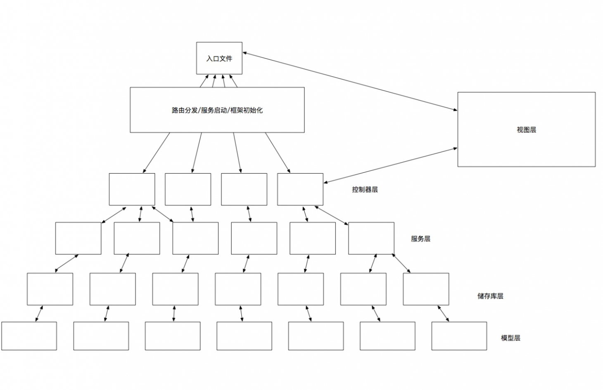

### PHP web框架介绍
#### 吴建强

---

> 吴建强
> - 链家网

---

> 曾就职于
> - 新浪，平台架构部，公有云平台SAE，PHP开发工程师
> - 百度，移动云事业部，手机百度业务线，Server端开发工程师
> - 链家网：
>   原大数据部负责人、上海研发中心总架构师、链家技术委员会委员
>   商业地产方向，商铺业务，产品技术负责人

---

> Web 框架
> - 流行的WEB框架设计模式有：
> - MVC
> - MVP
> - MVVC
> - VIPER
> - ...

---

> 众多设计模式中，MVC 最为经典，历史悠久的分层设计。
> MVC，全称是 Model View Controller，是模型 (model)－视图(view)－控制器 (controller) 的缩写。它表示的是一种常见的客户端软件开发框架。
> 视图层: 负责数据展示或者数据适配 (画面：电脑、手机网站界面)
> 模型层: 负责数据模型定义，数据获取（画面：文字、数字、图片地址等）
> 控制层: 用于控制模块入口负责逻辑分发（画面：将视图和模型连线）

---

> 现在的大部分 Web 框架都是使用金字塔式的分层架构，一般这种应用都是阻塞同步 IO 模型的编程实现，理解这种分层架构模型的实质有助于理解框架。
> 因为万变不离其宗，理解这种架构后你不管这种模型如何变化实际上都是在遵守一些约定和规则，那么理解这个模型，只要这个框架是这种架构那么你都会掌握的很快。
> 实际上，一般框架分层就是这种分层的，这种分层模型使用时通过一个入口文件启动框架服务，注册一些框架依赖，然后通过路由分发将请求分发到各个控制器里去，一般逻辑写在控制器层，模型层做数据处理，视图层负责展现。

---

> 我们在模型层和控制器层中增加服务层，服务层主要是将原来放置于控制层的业务逻辑处理单独封装，这样使得各层职责更加清晰，控制层主要负责流程控制，服务层主要负责逻辑处理。

---

> 当我们依赖的数据不仅仅只来自于数据库时，我们服务层就需要做更多于数据获取打交道的事情，为了使得各层职责单一，我们增加了存储层。存储层主要负责从各数据源获取数据，这里的数据源包括：数据库、第三方接口、缓存等等。用于封装数据获取的细节。

---

对于很多于业务逻辑无关的操作，比如日志记录，我们不想在每个业务逻辑开始处和结束的地方都写上日志代码，这样重复的工作就太多了。那么针对类似的操作，我们增加图上的蓝色部分，这叫做切面，面向切面编程（AOP），这种编程方法就是在需要的地方实现一个切面，把一些需要做但不是每个业务都要做的东西放到这里去做，如中间件、过滤器、拦截器、事件通知、观察者都算是这种切面的实现之一。

---